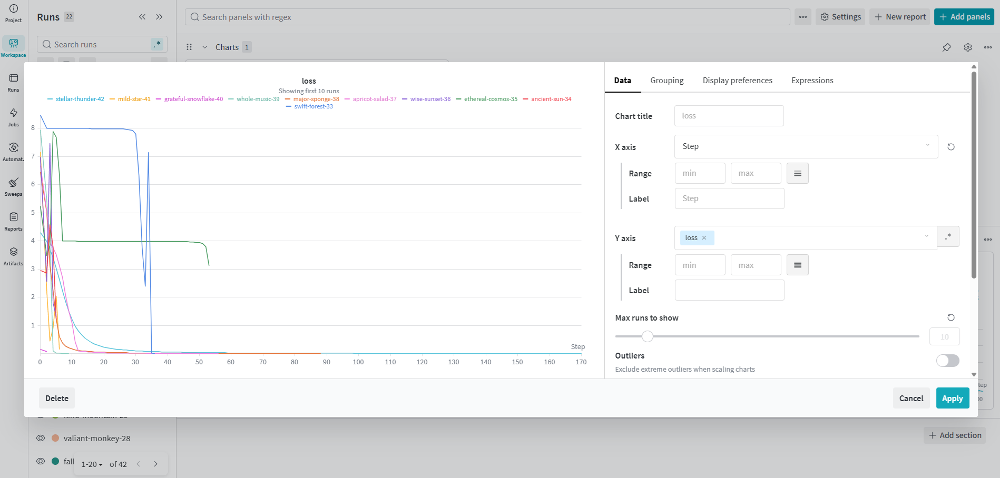

# nn_workouts 

A from-scratch implementation of PyTorch-like neural network primitives — tensors, neurons, and layers — built purely for the love of understanding what's happening under the hood.

Inspired by Andrej Karpathy's [micrograd](https://github.com/karpathy/micrograd), this project re-implements the core autodiff engine and a simple MLP from first principles, then wraps it with a production-grade toolchain to show how these kinds of experiments can be scaled and tracked properly.

---

## What's in here

| File | Description |
|------|-------------|
| `engine.py` | Scalar-valued autograd engine — the `Value` class with forward pass and backpropagation |
| `nn.py` | Neuron, Layer, and MLP classes built on top of `engine.py` |
| `train.py` | Training loop with Hydra config + Optuna hyperparameter sweep + W&B logging |
| `conf/` | Hydra YAML configs for training hyperparameters |
| `micrograd.ipynb` | Notebook walkthrough of the engine and network |
| `Dockerfile` | Containerized environment for reproducible runs |

---

## Why this project exists

Building tensors and backprop from scratch is one of the best ways to truly understand how deep learning frameworks work. This repo is a personal workout for that intuition.

The core math fits in two files. But the tooling around it reflects how I'd set up a real ML project:

- **Hydra** — config management, so hyperparameters live in YAML files instead of harcoding parameters in a letter soup or argparse spaghetti. Separates concerns by decoupling infrastructure from logic.
- **Optuna** — automated hyperparameter search with a proper pruning strategy. Optuna uses bayesian optiization instead of grid/random search. I used Hydra's plug in.
- **Weights & Biases** — experiment tracking, run comparison, and sweep visualization
- **Docker** — reproducible environment and portability.

Yes, this is a tiny model on a toy problem. That's intentional — the point is to demonstrate the workflow pattern.

---

## Quickstart

### Run locally

```bash
pip install -r requirements.txt
python train.py
```

### Run with Docker

```bash
docker build -t mlp-hydra-app .
docker run -e WANDB_MODE=offline mlp-hydra-app
```

### Override config with Hydra

```bash
python train.py training.learning_rate=0.01 training.epochs=100
```

### Run an Optuna sweep

```bash
python train.py --multirun hydra/sweeper=optuna +hpo=optuna
```

---

## W&B Sweep Results



---

## Stack

- Python
- Hydra
- Optuna
- Weights & Biases
- Docker

---

## Acknowledgements

Heavily inspired by Andrej Karpathy's [micrograd](https://github.com/karpathy/micrograd).